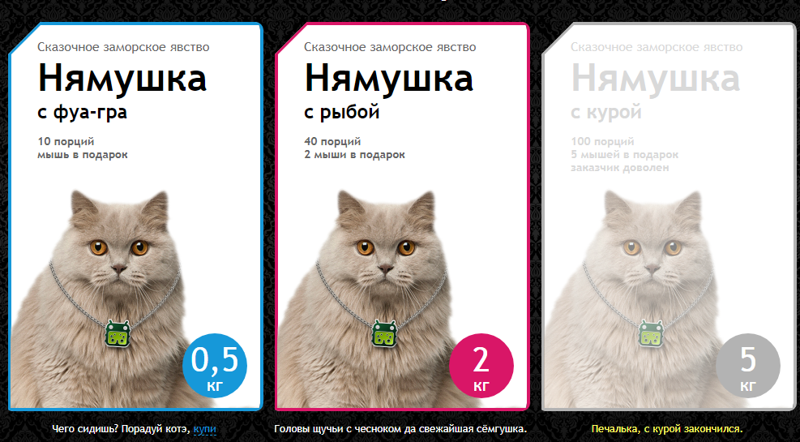

# <a name='nav'>Cat food</a>

Это тестовое задание. Вы можете посмотреть демо-версию сайта на [GitHub Pages по этой ссылке](https://voverg.github.io/layout-projects/cat-food 'Посмотреть демо-версию')

- [Описание](#description)

---

## <a name='description'>Описание</a>
Приложение "Cat food":
- Карточки имеют три состояния - по умолчанию, выбранная и не доступная
- Кликните на карточку, чтобы выбрать её
- Повторный клик отменяет выбор карточки

[Назад к заглавию](#nav)
