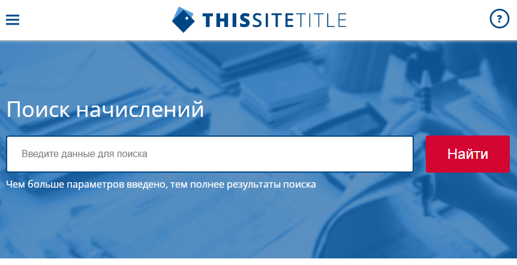

# <a name='nav'>Payer</a>

Это вёрстка учебного сайта. Вы можете посмотреть демо-версию сайта на [GitHub Pages по этой ссылке](https://voverg.github.io/layout-projects/payer 'Посмотреть демо-версию')

- [Описание](#description)

---

## <a name='description'>Описание</a>
Приложение "Payer":
- Есть мобильная и десктоп версия
- Реализовано бургер-меню
- Реализовано модальное окно при нажатии на пункт "Вход в личный кабинет"

[Назад к заглавию](#nav)
