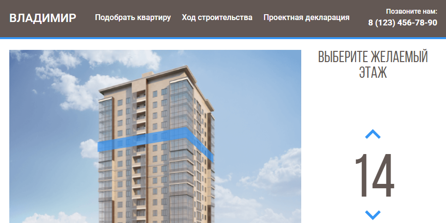

# <a name='nav'>Жилищный комплекс</a>

Вёрстка сайта жилищного комплекса с возможностью выбрать этаж и посмотреть квартиры на нём. Написан на HTML, CSS и чистом JavaScript. Вы можете посмотреть демо-версию сайта на [GitHub Pages по этой ссылке](https://github.com/voverg/layout-projects/tree/main/zhk 'Посмотреть демо-версию')

---

